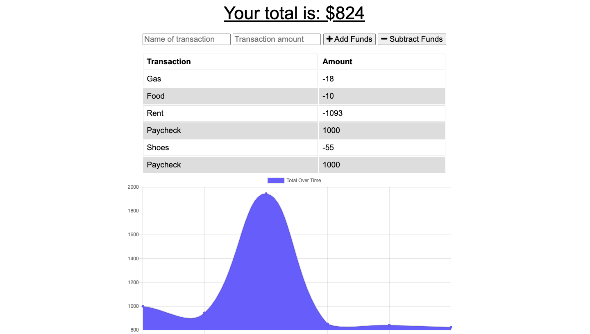
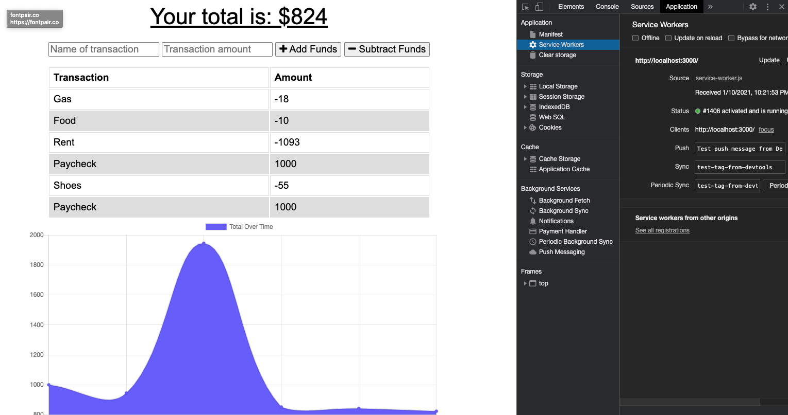

# budgetTracker

## Table of Contents:
*[Description](#description)  
*[Images](#images)  
*[Installation](#installation)  
*[Usage](#usage)  
*[License](#license)  
*[Contribute](#contribute)  
*[Tests](#tests)  
*[Questions](#questions)  

## DESCRIPTION:

The user will be able to add expenses and deposits to their budget with or without a connection. When entering transactions offline, they should populate the total when brought back online.

## IMAGES:

## INSTALLATION

express

mogoose

compression

morgan

lite-server

## USAGE

Track spending and payments, online or offline, PWA capable

## LICENSE

N/A

## CONTRIBUTE

used UNCC Bootcamp base code and Activities from Unit 18 as reference

## TESTS

N/A

## QUESTIONS

GitHub: lindsaymorris813
Email: lindsaymorris813@gmail.com